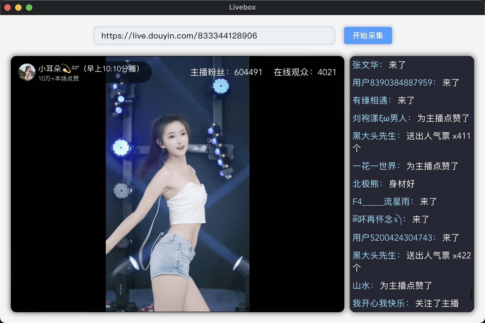

## 直播盒子

安安静静看直播，不要被礼物和各种诱导消费迷惑，冷静冷静冷静，商品和礼物也不一定非买不可，静静地看人生百态不也是一种享受。软件原理学习研究相关文章我已发布到我的博客上面，欢迎参观我的博客：  
[CSDN 博客：](https://blog.csdn.net/weixin_44786530?spm=1000.2115.3001.5343) https://blog.csdn.net/weixin_44786530?spm=1000.2115.3001.5343

[掘金博客：](https://juejin.cn/user/70007368988926)https://juejin.cn/user/70007368988926

## 功能介绍

可以获取直播视频和主播头像和昵称，直播聊天弹幕内容，但是屏蔽刷礼物功能，禁止刷礼物禁止消费，理性看播，看紧口袋。
windows/mac/linux 下载地址：https://github.com/Sjj1024/LiveBox/releases

## 界面介绍

注意：mac 电脑提示：已损坏,无法打开,你应该将它移到废纸篓，可以按照这篇文章解决：https://zhuanlan.zhihu.com/p/675337069

## TODO

1.长列表优化渲染  
2.直播视频优化

## 赞助

开源不易, 有了您的赞助, 我们会做的更好~

